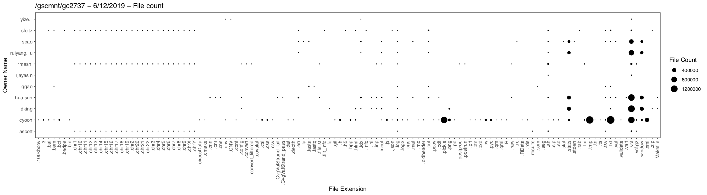
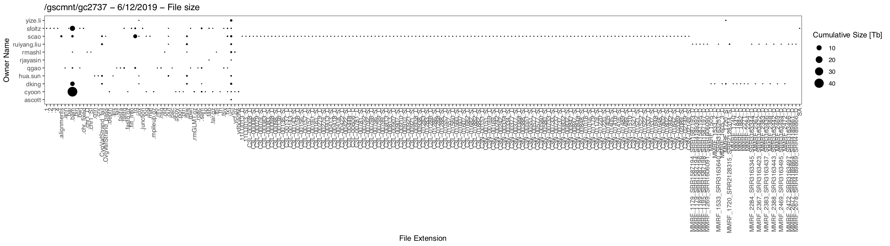

Scripts for performing analysis and visualization of filesystem usage

# Overview

Analysis currently consists of several scripts run to analyze a filesystem, followed by a visualization step which generates figures.

* `1_evaluate_gc2737.sh` - initial call which obtains information about all files in a specified filesystem, writes `rawstat` file
* `2_process_stats.sh`   - Secondary analysis of above data, writes `filestat` file
* `3_summarize_stats.sh` - Merge above data according to owner and extension, writes `summary` file

Finally, visualization is performed using `src/FSAudit.Rmd`.  The following plots are generated




Currently writing output to /gscmnt/gc3020/dinglab/mwyczalk

## Handy analysis

Get details for given extension and user:
```
zcat /gscmnt/gc3020/dinglab/mwyczalk/gc2737.20190612.filestat.gz | awk -v FS="\t" '{if ($3 == ".chr20" && $6 == "rmashl") print}'
```

# Background

## Relevant `stat` options

From `man stat`

       --printf=FORMAT
              like --format, but interpret backslash escapes, and do not output a mandatory trailing newline; if you want a newline, include \n in FORMAT

What I want in order
```
       %n     file name
       %F     file type
       %s     total size, in bytes
       %U     user name of owner
       %y     time of last modification, human-readable    
       %h     number of hard links
```
